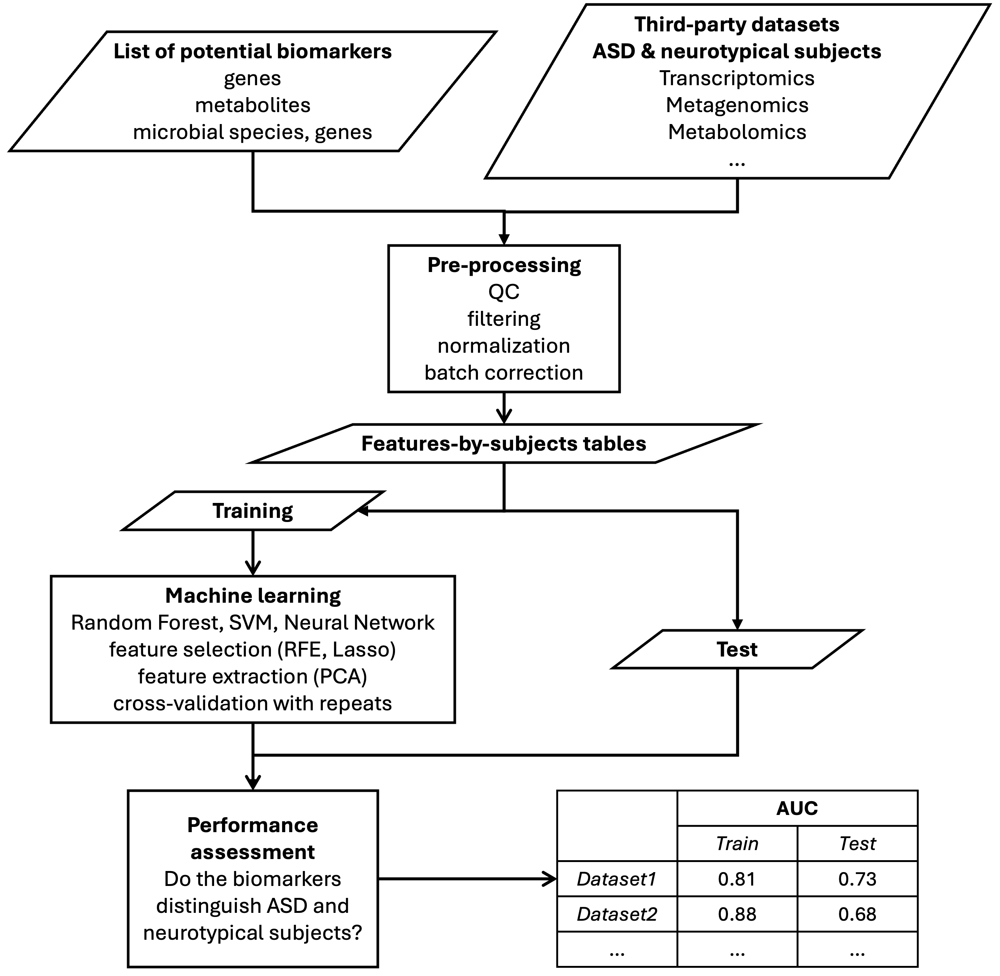

# Assessment of classification performance of biomarkers

We developed a pipeline to assess the performance of GEMMA biomarkers in distinguishing children with ASD from neurotypical children. Given a list of biomarkers and a series of third-party features-by-subjects datasets, the pipeline provides methods for data pre-processing. Subsequently, it uses machine learning models (neural networks, random forests, support vector machines) to test the performance of the biomarkers in distinguishing ASD vs controls on each dataset.

This pipeline is part of the [GEMMA Project Multi-Omics Toolbox](https://www.gemma-project.eu/toolbox)

Release: with the publication of articles by the GEMMA Consortium.

Contact: [Ettore Mosca](https://www.itb.cnr.it/en/institute/staff/ettore-mosca), Bioinformatics Lab, CNR-ITB
